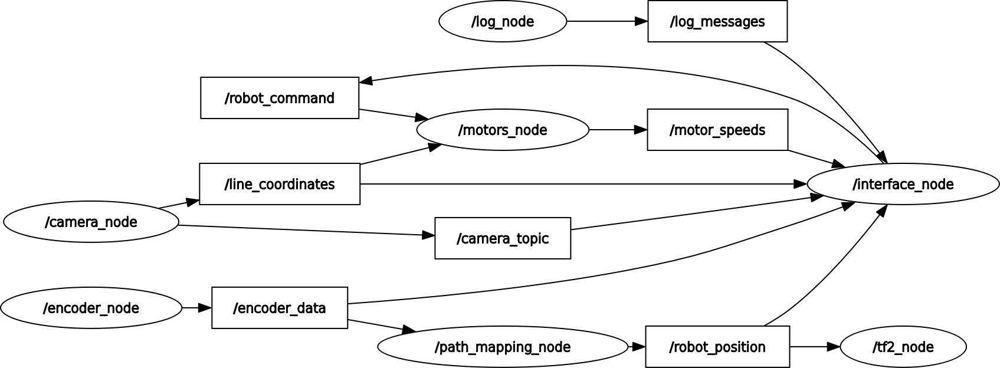
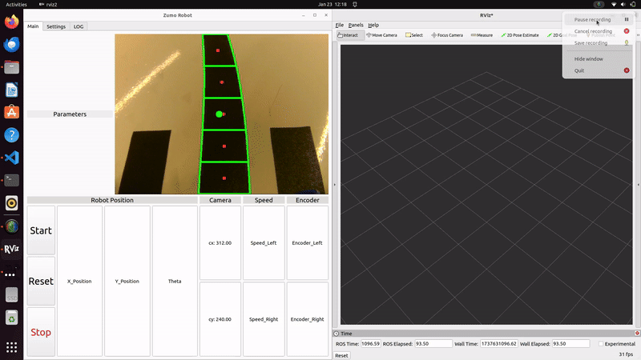

# ZumoRobot-ROS2

> ⚠️ **This project is no longer maintained.** The repository is archived for reference only.

**Camera-based line-following and path-mapping for the Zumo robot using ROS 2**

A complete robotics stack built on ROS 2 (Python / ament_python) that enables a Zumo Shield robot to autonomously follow a black line on a white surface using a USB webcam and OpenCV, while simultaneously mapping the traversed path via wheel-encoder dead-reckoning.

Developed as part of the Master's course *Autonomous Intelligent Systems* (Mechatronics & Robotics, Frankfurt UAS, WiSe 2024/2025).



---

## Demo



---

## Features

| Feature | Description |
|---|---|
| **Line detection** | HSV thresholding → contour analysis across 5 image sections; Kalman filter smoothing |
| **PID motor control** | Discrete-time PID with anti-windup, derivative low-pass filter; configurable via ROS parameters |
| **Encoder odometry** | Dead-reckoning from quadrature encoder ticks; publishes `Pose` and `OccupancyGrid` |
| **TF2 broadcasting** | `map → base_link` transform published for RViz visualisation |
| **Qt GUI** | PyQt5 dashboard: live video, encoder values, motor speeds, pose, log |
| **Custom Arduino library** | Ported Zumo encoder library for ATmega328P with interrupt-driven counting |

---

## Architecture

```
┌─────────────┐    line_coordinates    ┌──────────────┐   serial   ┌──────────┐
│ camera_node │ ─────────────────────► │ motors_node  │ ─────────► │ Arduino  │
└─────────────┘                        └──────────────┘            └──────────┘
       │ camera_topic                         ▲                          │ serial
       ▼                                      │ robot_command            ▼
┌──────────────┐                      ┌───────────────┐          ┌──────────────┐
│ interface    │ ◄────────────────────│ encoder_node  │ ◄────────│ Arduino      │
│ (Qt GUI)     │    encoder_data /    └───────────────┘          └──────────────┘
└──────────────┘    motor_speeds /          │ encoder_data
                    robot_position /        ▼
                    log_messages    ┌────────────────────┐
                                    │ path_mapping_node  │ ── robot_position ──► tf2_node
                                    └────────────────────┘
                                           │ path_map / visualization_marker
                                           ▼
                                         RViz2
```

---

## Hardware Requirements

| Component | Details |
|---|---|
| Zumo Shield for Arduino v1.2 | Base platform with DC motors |
| Arduino Uno (ATmega328P) | Motor control and encoder reading |
| Magnetic encoder pair | Pololu #3081 — 12 CPR, 2.7–18 V (external, mounted manually) |
| USB webcam | Any Linux-compatible UVC camera |
| Linux PC | Runs ROS 2 nodes |
| Track | Black line on white background, ≥ 2 cm width |

---

## Software Requirements

- **ROS 2** Humble or Jazzy (Ubuntu 22.04 / 24.04)
- Python 3.10+
- Arduino IDE ≥ 2.0

---

## Installation

### 1. System dependencies

```bash
sudo apt update
sudo apt install python3-pip python3-opencv python3-pyqt5 \
                 ros-$ROS_DISTRO-cv-bridge \
                 ros-$ROS_DISTRO-tf2-ros \
                 ros-$ROS_DISTRO-rviz2
sudo apt remove brltty   # conflicts with /dev/ttyUSB0 on Ubuntu 22.04
```

### 2. Clone and build

```bash
mkdir -p ~/ros2_ws/src && cd ~/ros2_ws/src
git clone https://github.com/<your-user>/ZumoRobot-ROS2.git
cd ~/ros2_ws
colcon build --packages-select zumo_robot
source install/setup.bash
```

### 3. Flash the Arduino firmware

1. Open `Zumo328P-Library/example/ZumoRos2/ZumoRos2.ino` in the Arduino IDE.
2. Install library dependencies via Library Manager: **ZumoShield**, **FastGPIO**.
3. Copy `Zumo328P-Library/library/` into your Arduino `libraries/` folder.
4. Flash to the Arduino Uno connected to the Zumo Shield.

---

## Usage

### Launch everything

```bash
ros2 launch zumo_robot launch_zumo.py
```

Optional arguments:

| Argument | Default | Description |
|---|---|---|
| `serial_port` | `/dev/ttyUSB0` | Arduino serial port |
| `target_position` | `320` | Image column for line centre (pixels) |

Example with custom port:

```bash
ros2 launch zumo_robot launch_zumo.py serial_port:=/dev/ttyACM0
```

### Run individual nodes

```bash
ros2 run zumo_robot camera_node
ros2 run zumo_robot encoder_node --ros-args -p serial_port:=/dev/ttyUSB0
ros2 run zumo_robot motors_node  --ros-args -p target_position:=320
ros2 run zumo_robot path_mapping_node
ros2 run zumo_robot interface_node
```

---

## ROS 2 Interface

### Topics

| Topic | Type | Direction | Description |
|---|---|---|---|
| `line_coordinates` | `Float32MultiArray` | camera → motors | Centroid `[cx, cy]` (pixels) |
| `camera_topic` | `sensor_msgs/Image` | camera → GUI | Annotated BGR frame |
| `encoder_data` | `Int32MultiArray` | encoder → path/GUI | `[left_ticks, right_ticks]` |
| `motor_speeds` | `Int16MultiArray` | motors → GUI | `[left_speed, right_speed]` |
| `robot_position` | `geometry_msgs/Pose` | path → tf2/GUI | Dead-reckoning pose |
| `path_map` | `nav_msgs/OccupancyGrid` | path → RViz | Visited-cell map |
| `visualization_marker` | `visualization_msgs/Marker` | path → RViz | Path LINE_STRIP |
| `robot_command` | `Int8` | GUI → motors | 0=stop, 1=start, 2=reset |
| `log_messages` | `std_msgs/String` | all → GUI | Status log |

### Parameters (motors_node)

| Parameter | Type | Default | Description |
|---|---|---|---|
| `serial_port` | string | `/dev/ttyUSB0` | Arduino port |
| `target_position` | int | `320` | Line-centre column |
| `kp` | float | `0.35` | PID proportional gain |
| `ki` | float | `0.10` | PID integral gain |
| `kd` | float | `0.10` | PID derivative gain |
| `max_speed` | float | `125.0` | Base motor speed |

---

## Serial Protocol (PC ↔ Arduino)

**PC → Arduino (7 bytes):**
```
0x02 | left_speed[0] | left_speed[1] | right_speed[0] | right_speed[1] | ctrl | 0x03
```
`ctrl`: `0x11` = normal run (request encoder reply), `0x12` = reset encoders.

**Arduino → PC (10 bytes):**
```
0x02 | right_enc[0..3] | left_enc[0..3] | 0x03
```
All multi-byte values are little-endian signed integers.

---

## Contributors

| Name | Role |
|---|---|
| Mutasem Bader | ROS 2 nodes, PID control, path mapping, Qt GUI, system integration |
| Felix Fritz Biermann | Image processing (camera node) |

---

## License

Copyright (c) 2026 Mutasem Bader — All Rights Reserved.  
Viewing is permitted. Copying, modifying, or submitting as own work is strictly prohibited.  
See [LICENSE](LICENSE) for details.
